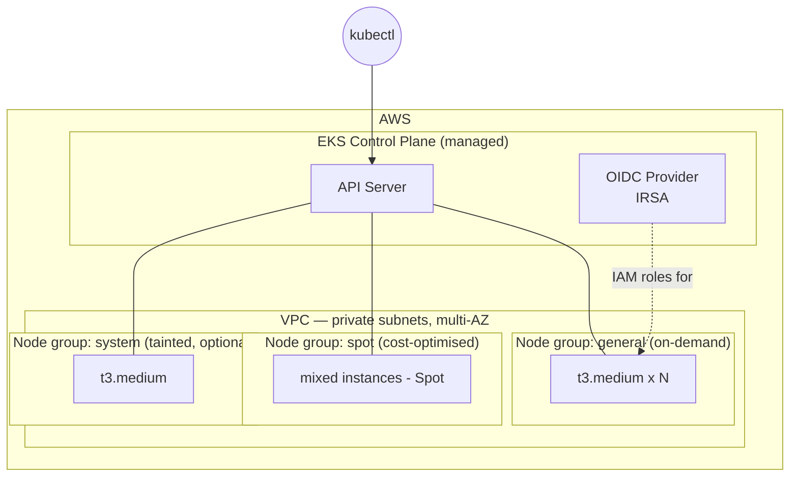

# AWS EKS Cluster (Multiple Node Groups)

A production-shaped Amazon EKS cluster provisioned with Terraform, with **multiple managed node groups** for workload separation — a general-purpose on-demand group and a cost-optimised Spot group, plus an optional tainted group for specialised workloads.

> **Outcome:** Stands up a multi-AZ EKS cluster with segregated on-demand and Spot node groups, IRSA enabled, and least-privilege IAM — ready for `kubectl` in one `terraform apply`.

## Architecture



## Why multiple node groups
Real clusters rarely run one homogeneous pool. This project shows you can:
- **Separate workloads by cost profile** — steady workloads on on-demand, fault-tolerant/batch on Spot.
- **Isolate system vs application pods** — a tainted `system` group that only tolerating pods land on.
- **Right-size independently** — each group scales and uses instance types suited to its workload.
- **Label + taint** so schedulers place pods deliberately (`nodegroup` labels, `dedicated` taints).

## What this demonstrates
- Managed EKS via Terraform (control plane, node groups, add-ons).
- IRSA (IAM Roles for Service Accounts) via the cluster OIDC provider — pods get least-privilege AWS access without node-wide credentials.
- Multiple managed node groups with distinct capacity types, labels, and taints.
- Core add-ons: VPC CNI, CoreDNS, kube-proxy.
- Reuse of the VPC from [`aws-terraform-foundation`](../aws-terraform-foundation) (pass in private subnet IDs).

## Repository layout
```
aws-eks-cluster/
├── modules/
│   ├── eks-cluster/     # control plane, IAM role, OIDC provider, add-ons
│   └── eks-node-group/  # reusable managed node group (called 3x)
├── environments/
│   └── dev/             # cluster + the three node groups wired together
│       └── terraform.tfvars.example
├── .gitignore
└── README.md
```

## Prerequisites
- Terraform >= 1.5, AWS credentials, `kubectl`, and (optional) `aws-iam-authenticator`.
- An existing VPC with **private subnets across ≥2 AZs** (from the foundation project or your own).

## Deploy
```bash
cd environments/dev
cp terraform.tfvars.example terraform.tfvars   # fill in vpc_id + private_subnet_ids
terraform init
terraform validate
terraform plan
terraform apply

# Then point kubectl at the new cluster:
aws eks update-kubeconfig --name <cluster_name> --region us-east-1
kubectl get nodes --show-labels     # verify all node groups joined
```

## Teardown
```bash
terraform destroy
```
> ⚠️ **Cost drivers:** the EKS control plane bills a flat **~$0.10/hr (~$73/mo)** whenever the
> cluster exists, plus EC2 for the nodes. Destroy when you're done demoing. Use the Spot group
> and `desired_size = 1` to minimise node cost while testing.

## Notes
- Node groups run in **private** subnets; they reach the internet via the VPC's NAT (enable NAT in the foundation layer for image pulls).
- The `system` node group is tainted `dedicated=system:NoSchedule` and disabled by default (`enable_system_group = false`) — enable it when you want to demo pod isolation.
- IRSA is wired up so add-ons like the AWS Load Balancer Controller or Cluster Autoscaler can be layered on later without node-wide IAM.
