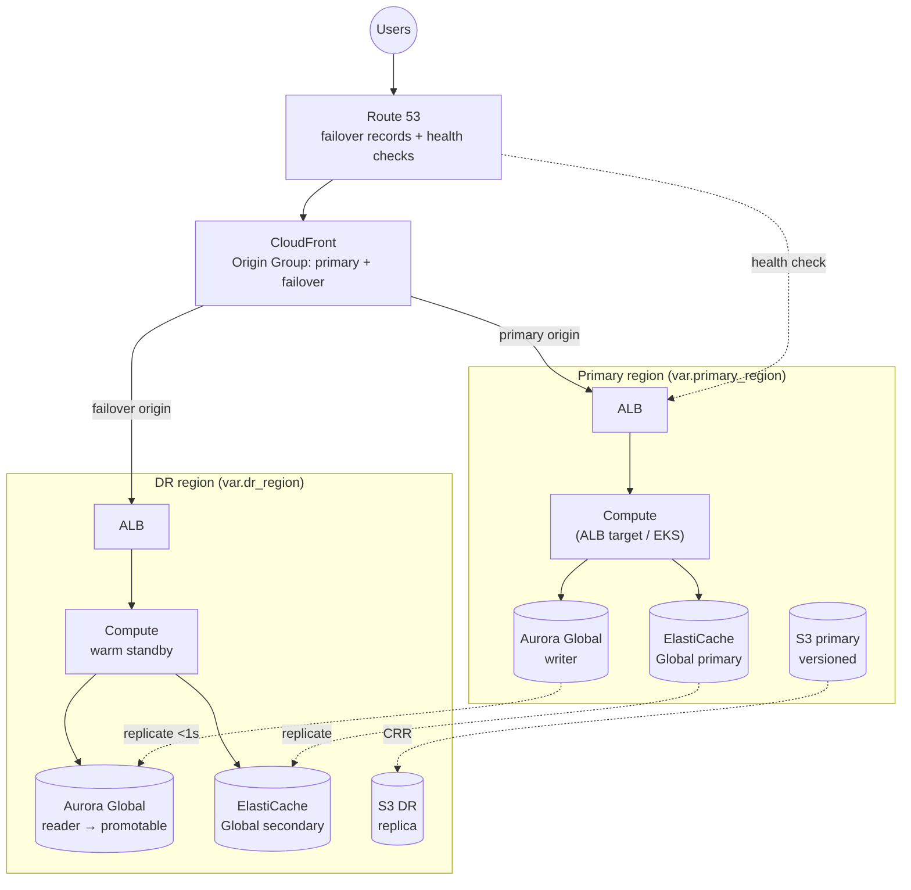

# AWS Multi-Region Disaster Recovery (active/passive failover)

An active/passive **multi-region disaster-recovery** architecture on AWS, built entirely with Terraform. The full stack runs in a **primary** region and a **warm-standby DR** region; automatic failover is driven by **Route 53 health checks** and a **CloudFront origin group**, with continuous data replication via **Aurora Global Database**, **ElastiCache Global Datastore**, and **S3 Cross-Region Replication**.

> **Outcome:** If the primary region fails, traffic fails over to the DR region automatically (CloudFront + Route 53), the Aurora Global Database is promoted, and the application keeps serving — meeting **RTO ≤ 30 min** and **RPO ≤ 5 min** for databases. Every region and resource name is configuration-driven — no hardcoding.

## Architecture



## How failover works
1. **Route 53 health check** monitors the primary ALB. On failure, the failover DNS record swings traffic to the DR ALB/CloudFront.
2. **CloudFront origin group** independently fails over at the CDN layer: if the primary origin returns 5xx/timeout, it retries the DR origin — sub-minute, no DNS TTL wait.
3. **Aurora Global Database** replicates to DR with typical lag < 1s (meets RPO ≤ 5 min); the DR cluster is **promoted** to writer on failover (`scripts/promote-aurora.sh`).
4. **ElastiCache Global Datastore** replicates Redis to DR; the secondary is promoted.
5. **S3 CRR** keeps objects replicated continuously (versioning required).

## Recovery objectives
| Objective | Target | How it's met |
|-----------|--------|--------------|
| **RTO** (time to recover) | ≤ 30 min | CloudFront origin failover (seconds) + Route 53 (TTL-bound) + Aurora promote (minutes) |
| **RPO** (data loss) | ≤ 5 min (DB) | Aurora Global continuous replication (typically < 1s) |

## Well-Architected (Reliability pillar)
- Multi-region, multi-AZ; automatic failover; continuous replication; tested recovery.
- Fully IaC and **idempotent**; **no hardcoded regions or names** — everything flows from `primary_region` / `dr_region` / `name_prefix`.

## What this demonstrates
- Active/passive multi-region DR wired end to end (edge → DNS → app → data).
- Aurora Global Database and ElastiCache Global Datastore replication + promotion.
- CloudFront origin-group failover and Route 53 health-check failover records.
- S3 Cross-Region Replication with versioning.
- Secrets/parameter replication and CloudWatch monitoring/alarms.
- DR automation scripts and a tested runbook that records real RTO/RPO.

## Repository layout
```
aws-multi-region-dr/
├── modules/
│   ├── network/        # VPC per region (reusable, region-agnostic)
│   ├── alb/            # ALB per region (failover origin/target)
│   ├── aurora-global/  # Aurora Global Database: primary writer + DR reader
│   ├── redis-global/   # ElastiCache Global Datastore
│   ├── s3-replication/ # S3 CRR + versioning
│   ├── cloudfront/     # distribution with primary+failover origin group
│   ├── route53/        # health checks + failover A/ALIAS records
│   └── monitoring/     # CloudWatch alarms + dashboard
├── environments/
│   └── dev/            # dual-provider root composing every module
├── scripts/            # DR automation: promote-aurora, failover, dr-test
├── RUNBOOK.md          # failover + failback + validation procedures
├── .gitignore
└── README.md
```

## Prerequisites
- Terraform >= 1.5, AWS credentials, two regions (default primary `us-east-1`, DR `us-west-2`).
- A registered Route 53 hosted zone (pass its ID) if you want real DNS failover; otherwise the module can create a private/test zone.

## Deploy
```bash
cd environments/dev
terraform init
terraform validate
terraform plan
terraform apply
```
Everything is variable-driven; change regions or naming without touching module code.

## Failover / recovery
See **[RUNBOOK.md](./RUNBOOK.md)** and `scripts/` — covers triggering failover, promoting Aurora/Redis in DR, validating, and failing back.

## Teardown
```bash
cd environments/dev
terraform destroy
```
> ⚠️ **Cost:** running a warm standby (Aurora Global secondary, ElastiCache Global, two ALBs,
> CloudFront) is **not free-tier** — this is a real multi-region footprint. Destroy when not
> demoing. Aurora Global and ElastiCache Global have specific teardown ordering (detach the
> secondary before deleting the global cluster) — the runbook documents it.
