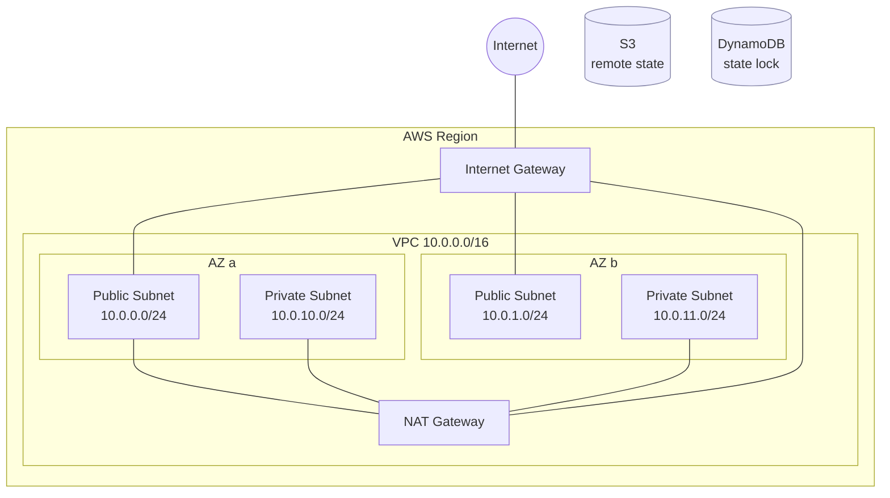

# AWS Terraform Foundation

Production-ready AWS network foundation, provisioned entirely with Terraform. One `apply` gives you a secure, multi-AZ VPC with public/private subnets, NAT, an IAM baseline, and remote state locking — reusable across `dev`, `staging`, and `prod`.

> **Outcome:** Provisions a prod-ready, multi-AZ VPC foundation with remote state and per-environment isolation in a single `terraform apply`.

## Architecture



## What this demonstrates
- Infrastructure as Code with reusable Terraform modules.
- Secure VPC design: public/private subnet split, NAT for private egress, no public IPs on private tier.
- Remote state with S3 + DynamoDB locking (safe for teams).
- Environment isolation via `environments/{dev,staging,prod}`.
- IAM baseline with least-privilege scaffolding.

## Repository layout
```
aws-terraform-foundation/
├── modules/
│   ├── vpc/          # reusable VPC: subnets, NAT, IGW, routes
│   └── iam/          # baseline IAM roles/policies
├── environments/
│   ├── dev/          # dev tfvars + backend + root config
│   ├── staging/
│   └── prod/
├── .gitignore
└── README.md
```

## Prerequisites
- Terraform >= 1.5 (or OpenTofu >= 1.6)
- AWS account + credentials (`aws configure` or env vars)
- An S3 bucket and DynamoDB table for remote state (see **Bootstrap** below)

## Bootstrap the state backend (one-time, per account)
Remote state needs a bucket + lock table to exist first. Create them once:

```bash
aws s3api create-bucket --bucket my-tf-state-<account-id> --region us-east-1
aws s3api put-bucket-versioning --bucket my-tf-state-<account-id> \
  --versioning-configuration Status=Enabled
aws dynamodb create-table --table-name tf-state-lock \
  --attribute-definitions AttributeName=LockID,AttributeType=S \
  --key-schema AttributeName=LockID,KeyType=HASH \
  --billing-mode PAY_PER_REQUEST --region us-east-1
```

Then set the same names in each `environments/*/backend.tf`.

## Deploy
```bash
cd environments/dev
terraform init      # configures the S3 backend
terraform validate
terraform plan      # review the plan
terraform apply     # provision
```

Repeat in `environments/staging` and `environments/prod` when ready.

## Teardown (avoid surprise cloud costs)
> ⚠️ **NAT Gateways bill per hour + per GB.** Destroy environments you are not actively demoing.

```bash
cd environments/dev
terraform destroy
```
The S3 state bucket and DynamoDB lock table are *not* managed here (they bootstrap the backend) — delete them manually if you're tearing everything down.

## Cost notes
- NAT Gateway is the main cost driver (~$0.045/hr + data). For a pure demo you can set `enable_nat_gateway = false` in tfvars to skip it.
- Everything else (VPC, subnets, IGW, route tables, IAM) is free.
