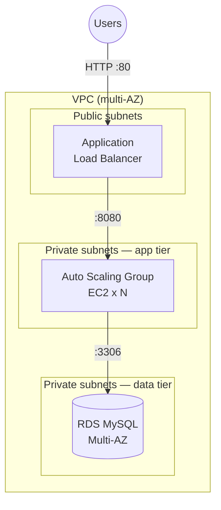

# AWS Three-Tier Application

A classic, production-shaped three-tier architecture on AWS, provisioned with Terraform: an internet-facing **Application Load Balancer** (web tier) fronting an **Auto Scaling Group** of app servers in private subnets (app tier), backed by a **Multi-AZ RDS** database in isolated private subnets (data tier).

> **Outcome:** Deploys a fault-tolerant, auto-scaling web application with a private database tier and zero public database exposure — in one `terraform apply`.

## Architecture



**Security posture (the point of the design):**
- ALB is the only internet-facing resource.
- App servers accept traffic **only from the ALB security group** — not the internet.
- RDS accepts traffic **only from the app security group** — never public.
- App instances use SSM for access (no SSH/port 22 open).

## What this demonstrates
- Layered security groups (each tier only talks to its neighbor).
- Auto Scaling + Load Balancing for high availability across AZs.
- Multi-AZ RDS with credentials injected via a variable (never hardcoded).
- Reuse of network primitives — designed to sit on top of the VPC from
  [`aws-terraform-foundation`](../aws-terraform-foundation), or any VPC you pass in.

## Repository layout
```
aws-three-tier-app/
├── modules/
│   ├── alb/       # ALB, target group, listener, ALB security group
│   ├── app/       # launch template, ASG, app security group
│   └── database/  # RDS instance, subnet group, DB security group
├── environments/
│   └── dev/       # wires the three modules together
├── .gitignore
└── README.md
```

## Prerequisites
- Terraform >= 1.5, AWS credentials.
- An existing VPC with **public** subnets (for the ALB) and **private** subnets
  (for app + db), spread across ≥2 AZs. Use the outputs from
  `aws-terraform-foundation` or supply your own IDs in `terraform.tfvars`.

## Deploy
```bash
cd environments/dev
cp terraform.tfvars.example terraform.tfvars   # fill in vpc_id, subnet ids, db_password
terraform init
terraform validate
terraform plan
terraform apply
```
After apply, Terraform outputs the **ALB DNS name** — open it in a browser to hit the app.

## Teardown
```bash
terraform destroy
```
> ⚠️ **Cost drivers:** the ALB (~$16/mo), NAT (from the VPC layer), and a Multi-AZ
> RDS instance all bill hourly. Destroy when you're done demoing. Set
> `db_multi_az = false` and `instance_count = 1` to minimise cost while testing.

## Notes
- The app tier runs a tiny user-data web server so the ALB health checks pass and
  you get a working page — swap in your real app AMI/user-data for production.
- `db_password` is marked `sensitive` and must be supplied at apply time (via
  tfvars or `TF_VAR_db_password`). In production, source it from Secrets Manager.
