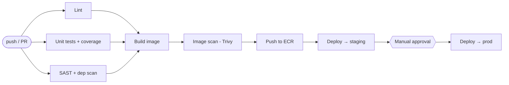

# CI/CD Pipeline — GitHub Actions (build → test → scan → deploy)

A production-shaped CI/CD pipeline built on GitHub Actions. Every push runs the full quality gate — **build → test → security scan → image build → deploy** — with staging on merge to `main` and a manually-approved promotion to production. Authentication to AWS uses **OIDC (no long-lived secrets)**.

> **Outcome:** A single push runs lint, tests, SAST, dependency + image vulnerability scans, builds a container, pushes it to ECR, and deploys to EKS — staging automatically, prod behind an approval gate.

## Pipeline



## Stages
| Stage | Tool | Fails the build when… |
|-------|------|------------------------|
| Lint | `ruff` / `hadolint` | style or Dockerfile issues |
| Test | `pytest` + coverage | any test fails / coverage drops |
| SAST | `bandit` | high-severity code issue |
| Dependency scan | `pip-audit` | known-vulnerable dependency |
| Image scan | `trivy` | HIGH/CRITICAL CVE in the image |
| Deploy | `kubectl` / `helm` | rollout does not become ready |

## What this demonstrates
- Multi-stage pipeline with **fail-fast quality gates** before anything ships.
- **Keyless AWS auth via GitHub OIDC** — an IAM role assumed by the workflow, zero stored keys.
- **Environment protection**: staging auto-deploys, prod requires a reviewer approval (GitHub Environments).
- Container build + push to **ECR**, deploy to **EKS** (the cluster from `../aws-eks-cluster`).
- Reusable **composite action** for the repeated "configure AWS + login to ECR" steps.
- Concurrency control + path filters so runs don't stack up or fire needlessly.

## Repository layout
```
cicd-github-actions/
├── .github/
│   ├── workflows/
│   │   ├── ci.yml            # PR + push: lint, test, scan (no deploy)
│   │   └── cd.yml            # main: build, image scan, push ECR, deploy stg → prod
│   └── actions/
│       └── aws-ecr-login/    # composite action: OIDC auth + ECR login
│           └── action.yml
├── app/                      # tiny Flask app so the pipeline has something real to build/test
│   ├── app.py
│   ├── test_app.py
│   └── requirements.txt
├── deploy/
│   └── k8s/                  # Deployment + Service applied by the CD job
│       ├── deployment.yaml
│       └── service.yaml
├── Dockerfile
├── .gitignore
└── README.md
```

## Setup (one-time)
1. **Create the GitHub OIDC IAM role** in AWS trusting this repo, with permissions for ECR push +
   EKS describe. (Extend Project #1/#3 IaC, or create manually.)
2. **Set repo variables** (Settings → Secrets and variables → Actions → *Variables*):
   - `AWS_REGION` (e.g. `us-east-1`)
   - `AWS_ROLE_ARN` (the OIDC role from step 1)
   - `ECR_REPOSITORY` (e.g. `portfolio-app`)
   - `EKS_CLUSTER` (e.g. `dev-eks`)
3. **Create GitHub Environments** `staging` and `production`; add required reviewers to `production`.

No secrets are stored — OIDC handles AWS auth at runtime.

## Run it
- Open a PR → **`ci.yml`** runs lint/test/scan.
- Merge to `main` → **`cd.yml`** builds, scans the image, pushes to ECR, deploys to staging, then
  waits for approval before prod.

## Local checks (same gates, before you push)
```bash
cd app
pip install -r requirements.txt
ruff check . && pytest --cov=. && bandit -r . && pip-audit
docker build -t portfolio-app:local ..
trivy image portfolio-app:local
```

## Notes
- The app is intentionally tiny — the star is the pipeline, not the code.
- Image scanning is set to fail on HIGH/CRITICAL; tune `severity` in `cd.yml` for your risk appetite.
- Deploy uses `kubectl rollout status` so a failed rollout fails the job (no silent bad deploys).
