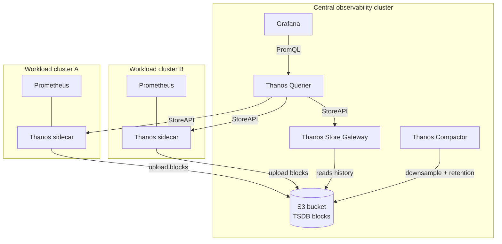

# Multi-Cluster Monitoring — Prometheus + Thanos + Grafana (S3 long-term storage)

A production monitoring stack that unifies metrics across **multiple Kubernetes clusters** and retains them **long-term in S3** via Thanos. Each workload cluster runs Prometheus (kube-prometheus-stack) with a **Thanos sidecar** that ships TSDB blocks to an S3 bucket. A central **observability cluster** runs the Thanos Store Gateway, Querier, and Compactor, plus Grafana — giving one query surface across every cluster and the entire retained history.

> **Outcome:** A single Grafana that queries live and historical metrics across all clusters, with unlimited retention backed by S3 — deployed with Helm.

## Architecture



**How the pieces fit:**
- **Sidecar** — sits next to each Prometheus, uploads completed 2h blocks to S3 and serves recent data over the StoreAPI to the Querier.
- **Store Gateway** — makes historical blocks in S3 queryable.
- **Querier** — fans out a single PromQL query to every sidecar + the store gateway and deduplicates results. This is what Grafana points at.
- **Compactor** — compacts and downsamples blocks in S3 and enforces retention. **Exactly one** compactor per bucket.
- **Grafana** — dashboards, using the Querier as its Prometheus datasource.

## What this demonstrates
- Multi-cluster observability with a global query view (not per-cluster silos).
- Long-term metric retention decoupled from Prometheus local disk, using S3.
- Correct Thanos component split (sidecar on edges, store/query/compact centrally).
- Helm-driven deployment with per-role `values.yaml` files.
- IRSA-based S3 access (no static keys in the cluster).

## Scope of this project
This project is **Helm values + manifests only**. It assumes the following already exist
(create them with your IaC of choice — e.g. extend Project #3):
- An **S3 bucket** for Thanos blocks (e.g. `my-thanos-metrics-<account-id>`).
- An **IRSA role** that the Thanos/Prometheus service accounts assume, granting `s3:*Object` /
  `s3:ListBucket` on that bucket. Project #3 already provisions the cluster OIDC provider needed
  for IRSA — annotate the service accounts with the role ARN (see `helm/values/*`).

## Repository layout
```
k8s-monitoring-thanos/
├── helm/
│   ├── objstore-secret.example.yaml   # Thanos S3 config (templated; real secret is applied out-of-band)
│   ├── values/
│   │   ├── workload-cluster.yaml      # kube-prometheus-stack + Thanos sidecar (per workload cluster)
│   │   └── central-thanos.yaml        # Thanos store/query/compact + Grafana (central cluster)
│   └── install.sh                     # helm repo add + install commands, per role
├── dashboards/
│   └── multicluster-overview.json     # sample Grafana dashboard (cluster label templating)
├── .gitignore
└── README.md
```

## Prerequisites
- Helm >= 3.8, `kubectl`, access to each cluster's kube-context.
- S3 bucket + IRSA role (see **Scope** above).
- Charts: `prometheus-community/kube-prometheus-stack`, `bitnami/thanos`.

## Deploy

### 1. Create the Thanos object-store secret (each cluster that talks to S3)
```bash
# Fill in bucket + region from objstore-secret.example.yaml, then:
kubectl -n monitoring create secret generic thanos-objstore \
  --from-file=objstore.yml=./objstore.yml
```
The secret uses IRSA for auth — no `access_key`/`secret_key` in the config.

### 2. Each workload cluster — Prometheus + Thanos sidecar
```bash
helm repo add prometheus-community https://prometheus-community.github.io/helm-charts
helm upgrade --install kube-prom prometheus-community/kube-prometheus-stack \
  -n monitoring --create-namespace \
  -f helm/values/workload-cluster.yaml
```

### 3. Central cluster — Thanos store/query/compact + Grafana
```bash
helm repo add bitnami https://charts.bitnami.com/bitnami
helm upgrade --install thanos bitnami/thanos \
  -n monitoring --create-namespace \
  -f helm/values/central-thanos.yaml
```
Point the Querier at each workload cluster's sidecar StoreAPI endpoint (see `central-thanos.yaml`
`query.stores`). Then add the Querier as Grafana's Prometheus datasource and import
`dashboards/multicluster-overview.json`.

See [`helm/install.sh`](helm/install.sh) for the full command sequence.

## Teardown
```bash
helm uninstall kube-prom -n monitoring   # on each workload cluster
helm uninstall thanos    -n monitoring   # on the central cluster
```
> ⚠️ The S3 bucket persists (it's the point — long-term storage). Empty/delete it separately if
> you're tearing everything down. Watch S3 storage + request cost as history accumulates; the
> Compactor's downsampling and retention settings control this.

## Design notes / gotchas
- **One compactor per bucket, ever.** Running two corrupts blocks. It lives only in the central values.
- **Unique external labels per Prometheus** (`cluster`, `replica`) — Thanos uses these to dedupe and
  to attribute blocks to a cluster. Set differently in each workload cluster's values.
- **Querier deduplication** relies on the `replica` label — keep everything else identical across HA replicas.
- Sidecar uploads only *completed* blocks (every 2h by default), so the freshest data is served live
  from the sidecar, and older data from the Store Gateway.
